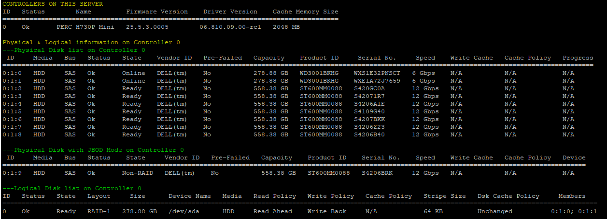

# dell-omreport-status
Show Raid Perc Adapter information 
Python script need libraries: texttable, termcolor to be printable 

usage: omreport-status [-h] [-f FORMAT]

optional arguments:
  -h, --help            show this help message and exit
  -f FORMAT, --format FORMAT
                        The type of output text/json (default is text
                        (default: text)
                        

